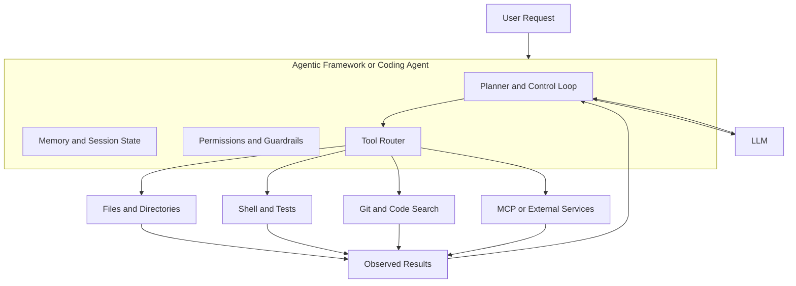

# An Introduction to Agentic Coding

This short handout is for developers who are already comfortable writing code in R and/or Python, but who are new to AI coding tools. The goal is not to turn programming into button-pushing. The goal is to understand a new kind of interface: one where you can ask for reasoning, editing, search, shell commands, file inspection, and workflow execution from inside the same working session.

The tool used here is [Antigravity CLI](https://github.com/google-antigravity/antigravity-cli), Google’s terminal-based coding agent. The official documentation is at [antigravity.google/docs](https://antigravity.google/docs/cli-overview).

Although the examples here use Antigravity CLI, the core workflow generalizes well to other coding agents such as Claude Code and Codex-style tools. The vocabulary and config file names vary, but the underlying pattern is similar: work inside a real repository, let the tool inspect actual files, and keep important project instructions in versioned text files.

## Table of Contents

- [Why this is different from a chatbot](#why-this-is-different-from-a-chatbot)
- [What agentic coding tools are good at](#what-agentic-coding-tools-are-good-at)
- [Core idea: from "answering" to "acting"](#core-idea-from-answering-to-acting)
- [The right mental model: colleague, not oracle](#the-right-mental-model-colleague-not-oracle)
- [Agentic frameworks: model versus agent](#agentic-frameworks-model-versus-agent)
- [Security and permissions](#security-and-permissions)
- [Tools, skills, and MCP](#tools-skills-and-mcp)
  - [Tools](#tools)
  - [Skills](#skills)
  - [MCP](#mcp)
- [Markdown as memory, process, and decision record](#markdown-as-memory-process-and-decision-record)
- [Installing Antigravity CLI on macOS and Linux](#installing-antigravity-cli-on-macos-and-linux)
  - [macOS](#macos)
  - [Linux](#linux)
  - [A practical setup note](#a-practical-setup-note)
- [A very small hello-world example](#a-very-small-hello-world-example)
- [A note on leaderboards and benchmarks](#a-note-on-leaderboards-and-benchmarks)
  - [1. Aider polyglot leaderboard](#1-aider-polyglot-leaderboard)
  - [2. SWE-bench](#2-swe-bench)
- [Suggested references for a short session](#suggested-references-for-a-short-session)
- [Four projects to try](#four-projects-to-try)
  - [1. Explore a Bioconductor repository](#1-explore-a-bioconductor-repository)
  - [2. Extract structure from a messy text file](#2-extract-structure-from-a-messy-text-file)
  - [3. Audit a small command-line workflow](#3-audit-a-small-command-line-workflow)
  - [4. Survey foundation models for transcriptomics and spatial transcriptomics](#4-survey-foundation-models-for-transcriptomics-and-spatial-transcriptomics)
- [A note on tokens and model costs](#a-note-on-tokens-and-model-costs)
- [Closing idea](#closing-idea)
- [AI assistance](#ai-assistance)

## Why this is different from a chatbot

Many developers first meet AI through a web chat window. That is a useful starting point, but it encourages a weak workflow:

1. Ask a question in a browser tab.
2. Copy a code snippet.
3. Paste it into your editor.
4. Notice it does not quite fit your repository.
5. Go back and repeat.

That is the "cut-and-paste" approach. It can help with isolated questions, but it breaks down once the task depends on the actual state of your project.

An **agentic coding tool** works differently. It is not just producing text. It can usually:

- inspect files on disk
- search a codebase
- edit files
- run shell commands
- keep track of session context
- follow repository-specific instructions
- use external tools through protocols such as MCP

That changes the unit of work. Instead of asking for "a regex in Python," you can ask:

> "Open this repository, find the script that reads the TSV, explain how the columns are normalized, and then add a small validation check before write-out."

That is the key distinction. A chatbot answers from a prompt window. An agentic coding tool can operate in the environment where the work actually lives.

## What agentic coding tools are good at

Agentic coding tools are especially strong whenever the task depends on **files on disk**. That includes:

- understanding an unfamiliar repository
- editing several files consistently
- updating documentation after code changes
- running tests or linters
- searching logs, configs, notebooks, and scripts together
- tracing where a function, dataset path, or environment variable is used
- applying a repeated refactor across many files

For Python and R users, this matters because so much day-to-day work is file-shaped: scripts, notebooks, CSV/TSV files, environment files, package metadata, Quarto or R Markdown, Snakemake or Nextflow pipelines, and test fixtures. If the tool can read the actual repository state, it can reason with fewer guesses.

## Core idea: from "answering" to "acting"

The simplest way to explain agentic coding is this:

- A chatbot mainly produces text.
- An agentic coding tool produces text **and can take bounded actions**.

That does not mean it should be allowed to do everything automatically. Good tools expose actions with approvals, scope, logs, and context. But the important shift is that the tool is no longer disconnected from the codebase.

Antigravity CLI is explicitly built around that model. Its documentation describes it as a terminal coding agent that brings multi-step reasoning, multi-file editing, tool calling, and conversation history to your terminal, with built-in support for file operations, shell commands, web fetching, and MCP integrations:

- [Antigravity CLI overview](https://antigravity.google/docs/cli-overview)
- [Antigravity CLI features](https://antigravity.google/docs/cli-features)
- [Antigravity CLI reference](https://antigravity.google/docs/cli-reference)

## The right mental model: colleague, not oracle

A common mistake when starting with agentic coding tools is to treat them as infallible oracles. They are not. A more useful mental model is a **capable but junior colleague**: someone who can read quickly, write reasonable first drafts, run commands, search for things, and follow instructions, but who needs clear direction, makes mistakes, and benefits from review.

The developer's job does not disappear. It shifts:

- from writing every line to **directing what to write and why**
- from remembering all context to **providing context clearly**
- from fixing bugs alone to **reviewing agent output the way you would review a pull request**
- from one-shot commands to **iterating with feedback**

Think of it less like consulting an expert and more like working with a new team member who happens to read code very fast and never gets tired. You would not hand a new team member an ambiguous task and walk away. You would give them a clear goal, check in on their progress, catch errors early, and push back when the approach is wrong.

That framing also helps calibrate frustration. When an agent makes a wrong assumption, the right response is usually a clearer prompt or more explicit context, not a different tool. The bottleneck is almost always the quality of the instructions.

## Agentic frameworks: model versus agent

One source of confusion is that people often talk about the model and the agent as if they were the same thing. They are not.

The **LLM** is the reasoning engine that predicts text, plans, explains, and decides what to do next. The **agentic framework** is the layer that gives that model structured access to tools, memory, control flow, permissions, and execution state.

Without the framework layer, you mostly have a strong text model. With the framework layer, you have a system that can repeatedly inspect files, choose an action, observe results, and continue.



The distinction matters because you can often swap one model for another while keeping much of the agent framework the same. In other words, the model supplies intelligence, but the framework supplies the workflow.

In practice, the framework layer is what usually handles:

- the loop of plan, act, observe, and revise
- tool calling and tool output handling
- file editing, shell execution, and search orchestration
- session memory and repository instruction files
- approval rules, sandboxes, and other safety controls

This is why it helps to separate questions like these:

- "Which model should I use?"
- "Which agent or framework gives the model the right tools?"
- "Which product wraps this in a usable coding workflow?"

Examples of agentic frameworks and scaffolds include projects such as LangGraph, AutoGen, OpenAI Agents SDK, PydanticAI, and smolagents. They differ in ergonomics and abstractions, but they are all trying to solve a similar problem: how to let a model operate as part of a controlled multi-step system instead of a one-shot text generator.

For day-to-day coding, you may interact with a finished tool such as Antigravity CLI, Claude Code, Aider, or another editor-integrated agent rather than building directly on a framework. Even so, the same architectural split still applies: one layer is the model, and another layer is the agent system that turns the model into something that can work on a repository.

## Security and permissions

It is worth knowing that agentic coding tools usually expose security and permission settings. These controls differ by product, but they often cover questions such as whether the agent can edit files automatically, run shell commands, access the network, or call external tools without asking first.

You do not need to memorize every option at the start. The practical point is simply that these settings exist, and they are worth reviewing before you let a tool operate broadly in a real repository.

## Tools, skills, and MCP

These three ideas are worth separating clearly.

### Tools

In an agentic coding environment, a **tool** is a capability the model can call to do something concrete. Antigravity CLI documents built-in tools for file access and shell execution, and its features page describes them as the mechanism that lets the model go beyond plain text generation:

- [Antigravity CLI features](https://antigravity.google/docs/cli-features)

Examples of tool-like actions include:

- reading a file
- listing a directory
- running `pytest`, `Rscript`, or `git status`
- fetching a web page
- saving a memory

This is why agentic systems are so useful for real coding work. The model does not have to imagine what `analysis.py` contains; it can open `analysis.py`.

### Skills

A **skill** is a reusable bundle of instructions and assets for a specific kind of task. In Antigravity CLI, skills are a first-class concept: localized Markdown blueprints that package specialized expertise, procedural workflows, and task-specific resources. Skills live alongside the broader plugin system, and are stored per project (in `.agents/skills/`) or globally:

- [Agent Skills](https://antigravity.google/docs/skills)
- [Plugins & Skills](https://antigravity.google/docs/cli-plugins)

It helps to think of a skill as a small, sharable playbook:

- when to use it
- what steps to follow
- what scripts, templates, or references belong with it

This is a powerful pattern for teams. A lab, research group, or engineering team can encode habits such as:

- "how we review a pull request"
- "how we run a reproducible R analysis"
- "how we audit API endpoints"
- "how we prepare a release"

Other tools use different names for roughly the same idea. Claude Code tends to lean more on instruction files and prompt conventions than on a named "skills" abstraction, and Codex-based workflows may package reusable guidance through repository instructions, prompt files, or host-specific agent definitions. The important point is not the label. It is that teams can externalize repeatable workflows so the agent does not have to rediscover them from scratch each session.

### MCP

**MCP** stands for **Model Context Protocol**. It is an open protocol for connecting AI applications to external tools and data sources.

- [What is MCP?](https://modelcontextprotocol.io/docs/getting-started/intro)
- [MCP specification](https://modelcontextprotocol.io/specification/2025-06-18/basic)

The official MCP introduction describes it as a kind of "USB-C port for AI applications." That analogy is useful: the point is standardization. Instead of every tool inventing a different one-off integration, MCP provides a common way to expose tools, resources, and prompts.

Antigravity CLI has dedicated support for MCP servers, configured either globally or per project in an `mcp_config.json` file:

- [MCP with Antigravity](https://antigravity.google/docs/mcp)
- [Antigravity CLI features](https://antigravity.google/docs/cli-features)

In practice, MCP is what lets an agentic tool extend beyond the local filesystem. For example, you might connect a coding agent to:

- GitHub
- a database
- an internal documentation system
- cloud services
- a domain-specific tool maintained by your team

## Markdown as memory, process, and decision record

One of the most important habits in agentic coding is using Markdown files to capture project memory.

This matters for two reasons. First, the AI needs stable context. Second, human teams need stable context. A good Markdown file serves both.

Antigravity CLI uses `AGENTS.md` as its default context file name. Anything you write in an `AGENTS.md` at the root of a project is prepended to prompts processed inside that directory:

- [Antigravity CLI features](https://antigravity.google/docs/cli-features)
- [Antigravity CLI overview](https://antigravity.google/docs/cli-overview)

This is more than configuration trivia. It suggests a very practical point:

> Markdown files are a low-friction way to encode how a codebase works, what decisions were made, and how the agent should behave.

This is also a good place to point out cross-tool conventions. The `AGENTS.md` filename Antigravity CLI uses is a shared convention: Codex-oriented workflows read the same file, so a single `AGENTS.md` can guide more than one agent. Claude Code commonly uses `CLAUDE.md` for repository guidance instead. The exact filename matters less than the habit: keep durable instructions in the repository, in plain text, where both humans and agents can find them.

Examples of useful Markdown memory:

- repository conventions
- coding style
- testing expectations
- architecture notes
- deployment steps
- analysis assumptions
- "do not touch this generated directory"
- "always update the changelog when schema files change"

For R and Python teams, this can be especially effective because so many projects already rely on text-first artifacts such as `README.md`, `CONTRIBUTING.md`, `analysis-plan.md`, `methods.md`, `CHANGELOG.md`, and lab notebooks.

The larger lesson is that agentic coding rewards explicitness. If a decision matters repeatedly, put it in a Markdown file instead of repeating it in chat forever.

If you work with more than one tool, it is worth keeping this explicit: `AGENTS.md` and `CLAUDE.md` are not just random dotfiles. They are examples of a broader pattern of repository-scoped AI instructions.

## Installing Antigravity CLI on macOS and Linux

The current official installation guide is here:

- [Installation & auth](https://antigravity.google/docs/cli-install)
- [Getting started with Antigravity CLI](https://antigravity.google/docs/cli-getting-started)

If you are coming from Gemini CLI, Google also publishes a dedicated migration guide:

- [Migrating from Gemini CLI](https://antigravity.google/docs/gcli-migration)

As of June 2026, the baseline requirements are modest:

- macOS or a supported Linux distribution
- `curl` (used by the install script)
- A Google account for authentication

Antigravity CLI ships as a single self-contained binary, so there is no separate Node.js, Homebrew, or package-manager step.

### macOS

The official install script downloads the binary and places the `agy` executable in `~/.local/bin`:

```bash
curl -fsSL https://antigravity.google/cli/install.sh | bash
```

Make sure `~/.local/bin` is on your `PATH` (the installer will tell you if it is not). Then start the tool:

```bash
agy
```

For most individual users, the recommended authentication path is to launch `agy` and choose **Sign in with Google** in the interactive browser prompt.

### Linux

On a supported Linux distribution, the install command is the same single line:

```bash
curl -fsSL https://antigravity.google/cli/install.sh | bash
```

Then start:

```bash
agy
```

If you are working over SSH on a remote machine, Antigravity CLI prints an authorization URL you can open in a local browser to complete sign-in. Browser-based Google sign-in is the simplest path; enterprise and API-key options are covered in the installation and authentication docs:

- [Installation & auth](https://antigravity.google/docs/cli-install)

### A practical setup note

If you are trying Antigravity CLI for the first time, browser-based login with a Google account is usually the least confusing path. It minimizes setup overhead and gets you to the main point quickly: the agent can work with the repository in front of you.

Also relevant if you work in these languages: Google documents both **Python** and **R** among its verified coding languages:

- [Supported languages, IDEs, and interfaces](https://developers.google.com/gemini-code-assist/docs/supported-languages)

## A very small hello-world example

If you are just getting started, avoid beginning with "build a web app." Start with a local file and a concrete edit. That shows what is distinctive about an agentic tool.

Create a directory and a tiny Python file:

```bash
mkdir hello-antigravity
cd hello-antigravity

cat > hello.py <<'EOF'
name = "world"
print(f"Hello, {name}!")
EOF
```

Now start Antigravity CLI:

```bash
agy
```

Then try prompts like these:

```text
Explain this small project.
```

```text
Open hello.py and explain what it does in plain English for a beginner.
```

```text
Edit hello.py so that it accepts a command-line argument for the name, and defaults to "world" if no argument is provided.
```

```text
Now add a second file called test_hello.py with one simple pytest test.
```

This is a better first exercise than a standalone browser chat because you can watch the tool reason about the actual file, modify it, and create a second file that fits the task.

The same structure works well in Claude Code or Codex-style environments. You do not need a different exercise; you mostly need to translate the prompt and point the tool at the right repository instruction file.

If you want an R-flavored version, try using the prompt to :

```text
Create an R version of this project. The main script should be called hello.R and the test script should be test_hello.R using the testthat framework.
```

Take a look at the generated files. Notice how the agentic tool can create a consistent set of files that work together, instead of just generating one snippet in isolation.

You can keep going by turning the R version into a proper package structure with `DESCRIPTION`, `NAMESPACE`, and a `tests/` directory. That shows how the tool can manage multiple files and understand project conventions.

```text
Refactor the R version of this project into a proper R package structure. Create a DESCRIPTION file, a NAMESPACE file, and move the test script into a tests/ directory following standard R package conventions. 
```

The agentic tool should be able to create a more complex project structure with multiple files that follow the conventions of an R package. That is a concrete example of how these tools can manage real codebases, not just generate snippets.

You can also ask it to run the tests from the command line:

```text
Run the tests for the R package you just created and report the results.
```

## A note on leaderboards and benchmarks

A leaderboard can be helpful, but it is important to explain what is being measured.

Most public leaderboards do **not** rank a CLI wrapper such as Antigravity CLI by itself. They usually rank:

- language models
- full agent systems
- benchmark scaffolds
- combinations of model plus prompting plus tool setup

Still, two benchmark families are worth knowing about because they help explain why agentic coding is now taken seriously.

### 1. Aider polyglot leaderboard

- [Aider LLM Leaderboards](https://aider.chat/docs/leaderboards/)

This is a practical coding benchmark based on code editing tasks across several languages. It is useful because it evaluates whether a model can actually make correct edits, not just talk about code fluently.

### 2. SWE-bench

- [SWE-bench leaderboard](https://www.swebench.com/)
- [SWE-bench Verified](https://www.swebench.com/verified.html)
- [SWE-bench paper (OpenReview)](https://openreview.net/forum?id=VTF8yNQM66)

SWE-bench is important because it is based on real GitHub issues and real repositories. That makes it closer to the sort of messy, multi-file work that professional developers actually do.

The key message is not "which model is number one this week." The key message is:

> modern coding agents are now good enough that repository-aware, tool-using workflows are worth learning as a normal part of software practice.

## Suggested references for a short session

If you want a compact reading list, start with these:

- [Antigravity CLI GitHub repository](https://github.com/google-antigravity/antigravity-cli)
- [Antigravity CLI overview](https://antigravity.google/docs/cli-overview)
- [Installation & auth](https://antigravity.google/docs/cli-install)
- [Getting started with Antigravity CLI](https://antigravity.google/docs/cli-getting-started)
- [Antigravity CLI reference](https://antigravity.google/docs/cli-reference)
- [Agent Skills](https://antigravity.google/docs/skills)
- [MCP with Antigravity](https://antigravity.google/docs/mcp)
- [Model Context Protocol introduction](https://modelcontextprotocol.io/docs/getting-started/intro)
- [SWE-bench paper](https://openreview.net/forum?id=VTF8yNQM66)
- [SWE-bench leaderboards](https://www.swebench.com/)

## Four projects to try

If you want to move beyond toy examples, the best next step is to give the agent a task that depends on real files, real conventions, and real decisions. The three projects below are meant to exercise different parts of agentic coding.

### 1. Explore a Bioconductor repository

**Why this is useful:** Bioconductor packages are a good test of repository understanding because they mix code, documentation, vignettes, metadata, and domain-specific conventions. This is a realistic example of the kind of codebase that is difficult to understand through snippets alone.

Pick a Bioconductor repository that looks interesting to you. Good candidates are packages with active documentation and a non-trivial codebase, such as `DESeq2`, `GenomicRanges`, `BiocFileCache`, or `SingleCellExperiment`.

Start by cloning one repository and opening it in your coding environment. Then ask the agent to do tasks like these:

```text
Explain the purpose of this package in plain language, then identify the most important source files and describe how they fit together.
```

```text
Find one exported function that seems central to the package. Trace where it is implemented, how it is documented, and which tests exercise it.
```

```text
Read the vignette and summarize the main user workflow, then compare that workflow to the internal code structure.
```

This project exercises codebase search, file inspection, documentation reading, and cross-referencing between source, tests, and user-facing materials.

### 2. Extract structure from a messy text file

**Why this is useful:** Many real tasks are not "write a new function" tasks. They are "take this messy text artifact and turn it into structured data" tasks. This is a good way to see whether the agent can combine file creation, parsing logic, validation, and command-line execution.

Create a file called `field_notes.txt` with content like this:

```text
2026-04-10 | Site A | observer: Kim | species: heron | count: 12 | notes: 3 near marsh edge
2026-04-10 | Site B | observer: Rao | species: egret | count: 7 | notes: one tag unreadable
2026-04-11 | Site A | observer: Kim | species: heron | count: twelve | notes: transcription uncertain
2026-04-11 | Site C | observer: Patel | species: ibis | count: 4 | notes: weather windy
2026-04-11 | Site B | observer: Rao | species: egret | notes: count missing
```

Then give the agent a task such as:

```text
Create a Python script that parses field_notes.txt into a CSV file, flags rows with invalid or missing counts, and prints a short summary by species. Add one or two tests for the parser.
```

You can extend the exercise by asking the agent to produce both a "clean" table and a separate "problems" report.

This project exercises local file creation, parsing, validation, error handling, tests, and iterative refinement after inspecting bad input.

More generally, agents can usually read PDFs, HTML files, and other text-based formats. At this point, many can also parse word documents, excel files, powerpoint presentations, etc. That makes them useful for extracting structured data from a wide variety of messy sources.

### 3. Audit a small command-line workflow

**Why this is useful:** Agentic tools are especially helpful when you need to understand not just one file, but how files and commands interact. A small workflow audit is a compact way to practice that skill.

Create a tiny project with three files:

- `download_data.sh`
- `analyze.py`
- `README.md`

Put a few deliberate rough edges into it. For example, let the shell script write to a hard-coded path, let the Python script assume a column name that is not documented, and let the README omit one setup step.

Note that you can also JUST ASK THE AGENT TO CREATE THIS MINI-PROJECT. That is a good way to see how it handles multiple files and cross-file consistency.

Then ask the agent to do this:

```text
Review this mini-project and identify the assumptions that would cause it to break on another machine. Then fix the problems, update the README, and explain the changes.
```

You can make the exercise richer by asking for a Makefile, a simple test, or a more portable way to pass paths and parameters.

This project exercises repository inspection, shell understanding, documentation repair, and the ability to connect user instructions to actual executable code.

### 4. Survey foundation models for transcriptomics and spatial transcriptomics

**Why this is useful:** The landscape of foundation models for single-cell and spatial transcriptomics moves fast and is genuinely hard to navigate. Published papers often describe models that have prototype code but are not practically installable. At the same time, a smaller number of projects are actively maintained, well-documented, and used by real lab workflows. Agentic tools with web access are well-suited to doing this kind of structured literature and code survey, because the task involves reading many sources, comparing them against consistent criteria, and producing a summary you can actually act on.

The prompt below is designed to yield a comparative table rather than a flat list, and to explicitly probe usability signals that papers and abstracts tend to omit.

```text
Search the web and GitHub for foundation models designed for single-cell transcriptomics or
spatial transcriptomics. Identify at least ten distinct models. For each one, collect the
following information and produce a Markdown table:

- Model name and primary citation or preprint
- Modalities supported (scRNA-seq, spatial, multiome, ATAC, etc.)
- GitHub repository URL, if one exists
- Number of GitHub stars and date of most recent commit
- Whether a pip- or conda-installable package exists (yes / no / partial)
- Whether tutorial notebooks or vignettes are present in the repository (yes / no)
- Whether the documentation covers installation for a user who is not the author (yes / no)
- A one-sentence description of the primary task the model was designed for

After the table, write a short paragraph distinguishing the models that appear to be
actively maintained and accessible to a working bioinformatician from those that appear to
be research prototypes unlikely to be usable without significant effort. Use the GitHub
activity and packaging signals as your primary evidence, not the citation count.
```

If the agent returns a table faster than you expected, a good follow-up is:

```text
For the two or three models you rated as most accessible, check whether their GitHub issues
show evidence of community use: recent issues opened by external users, pull requests from
non-authors, or explicit questions about installation and data formats. Report what you find.
```

This project exercises web search, GitHub repository inspection, structured comparison across many sources, and evidence-based judgment rather than recitation of abstracts.

## A note on tokens and model costs

As you start using agentic coding tools on real projects, it helps to track token usage and model cost. Most tools expose some combination of usage metrics, rate limits, or billing dashboards.

A simple mental model is:

- more input context (large files, long chats, many tool outputs) usually means more tokens
- more turns in a session usually means more tokens
- larger or premium models usually cost more per token than smaller models

Practical ways to manage cost without losing quality:

- start with focused prompts and only include the files that matter
- summarize or trim very long outputs before the next step
- use a smaller model for exploration, then switch to a stronger model for critical edits or review
- reset or branch a conversation when context becomes noisy
- check usage reports periodically so cost does not become a surprise

Worked example (illustrative only):

- Session A (focused): 6 turns, about 2,000 tokens per turn on average -> about 12,000 total tokens
- Session B (broad and noisy): 14 turns, about 8,000 tokens per turn on average -> about 112,000 total tokens

Even before model pricing differences, Session B uses about 9 times more tokens than Session A. If Session B also uses a higher-cost model tier, total spend can rise much faster than expected.

One practical budgeting pattern is:

- do discovery and file triage with a lower-cost model
- switch to a stronger model only for the final implementation pass and review
- keep each conversation scoped to one objective

You do not need exact pricing memorized. The important habit is to treat tokens as a real resource, just like compute time or API calls.

## Closing idea

If you remember only one thing from this document, let it be this:

**Agentic coding tools are most useful when the work depends on the state of real files, real commands, and real project context.**

That is what separates them from ordinary chatbots and from the copy/paste workflow. They are not just text generators. They are becoming practical collaborators inside the working environment where software and analysis are actually built.

## AI assistance

This document was structured, edited, and written with the help of AI tools, including Antigravity CLI, OpenAI Codex, and GitHub Copilot. That is intentional: using agentic and AI-assisted tools to produce a document about agentic and AI-assisted tools is itself a reasonable demonstration of the workflow described here.
