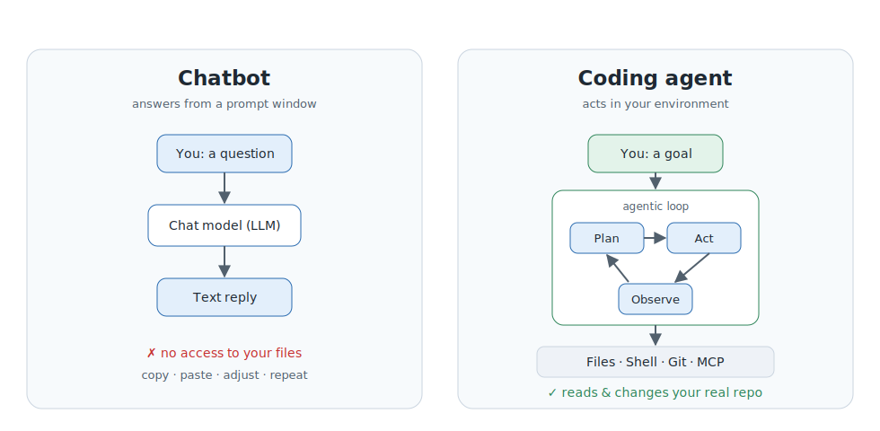
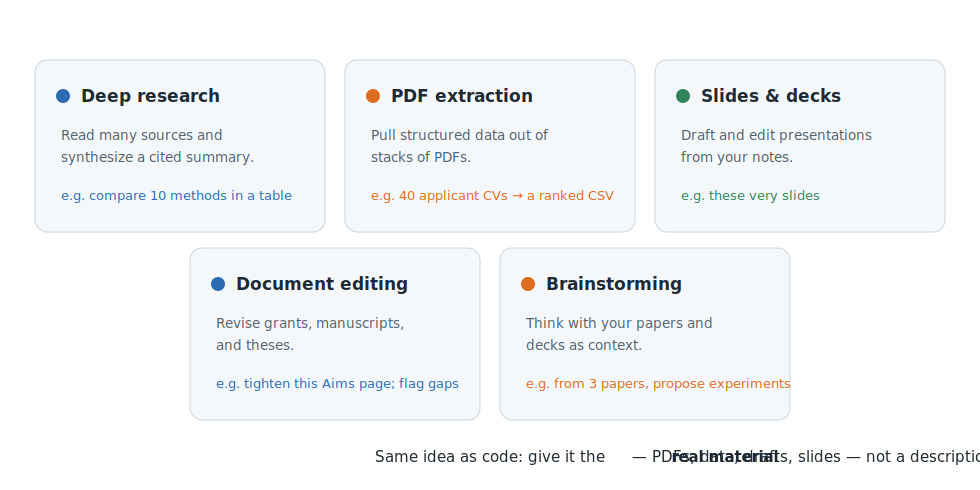
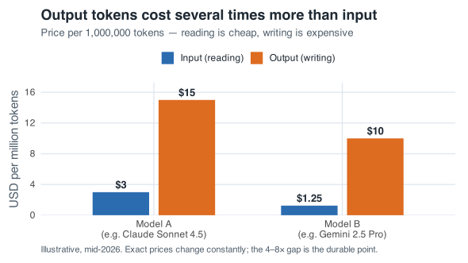
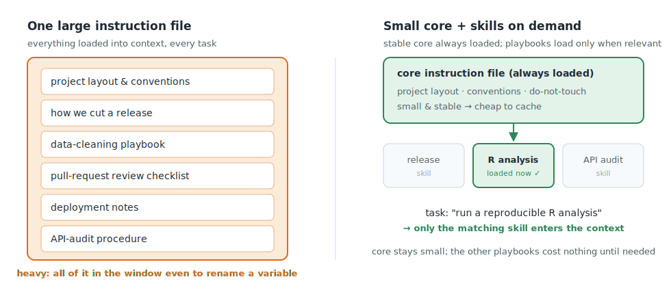

## You already know the hard part

You use chatbots. You write prompts. You judge whether the answer is any good.

. . .

That intuition transfers directly. This session adds three things:

- what changes when the AI can **act in your files**, not just chat
- what is actually happening under the hood — **context** and **tokens**
- a few habits that make these tools **cheaper and sharper**

::: notes
Anchor to what they already do. Most of the audience uses ChatGPT/Claude/Gemini
as a chat window. The goal today is not "learn to code differently" — it's to
understand a new interface and a handful of mental models. Keep it concrete and
tool-neutral; examples will span Gemini CLI, Claude Code, and ChatGPT.
:::

# Part 1 — Chatbot vs. coding agent {background-color="#222c38"}

## Two ways to use the same model

{width="92%"}

::: notes
The model is the same kind of thing in both columns. The difference is the
scaffolding around it. A chatbot answers from a prompt window — you copy, paste,
adjust, repeat. A coding agent runs a loop: plan an action, call a tool (read a
file, run a command), observe the result, and continue — and it does this inside
your actual repository, with permissions.
:::

## Why this matters for research work

So much of our day is **file-shaped**:

- scripts, notebooks, Quarto / R Markdown
- CSV / TSV data, config and environment files
- package metadata, Snakemake / Nextflow pipelines, test fixtures

. . .

A chatbot reasons about a *snippet you paste*.
An agent reasons about the *files as they actually are*.

> "Open this repo, find the script that reads the TSV, explain how the columns
> are normalized, then add a validation check before write-out."

::: notes
This is the key distinction worth repeating. The unit of work changes from
"a regex in Python" to "operate on the real project." For a biomedical audience,
ground it in their world: exploring an unfamiliar Bioconductor package, cleaning
a messy field-notes file, auditing a small pipeline.
:::

## Not just code — knowledge work too

{width="90%"}

::: notes
This is the slide that makes the talk relevant to everyone in the room, not just
the people who write pipelines. The same capabilities — read files, follow
instructions, call tools, hold context — power document work too. Concrete
prompts to mention or demo:

- Deep research: "Search the web and PubMed for recent reviews of X; read the top
  sources and write a one-page synthesis with citations, noting disagreements."
- PDF extraction: "These 40 applicant CVs are PDFs — extract degree, methods, and
  first-author papers, score against rubric.md, and give me a ranked CSV." Works
  the same for course applications or pulling data out of papers.
- Slides: "Turn outline.md into a 12-slide deck with speaker notes" — exactly how
  this deck was built.
- Document editing: "Tighten this grant Aims page, flag claims needing citations,
  and list inconsistencies with the summary."
- Brainstorming: "Given these three papers and my deck, propose three follow-up
  experiments and push back on my weakest framing."

The thread is the same: give it the real material, not a description of it.
:::

## The right mental model

A **capable but junior colleague** — not an oracle.

- reads fast, drafts quickly, runs commands, follows instructions
- also: makes mistakes, needs clear direction, benefits from review

. . .

Your job shifts:

- from writing every line → **directing what to write and why**
- from remembering context → **providing context clearly**
- from fixing alone → **reviewing output like a pull request**

::: notes
This framing calibrates frustration. When the agent makes a wrong assumption,
the fix is usually a clearer prompt or better context — not a different tool.
The bottleneck is almost always the quality of the instructions. You wouldn't
hand a new team member an ambiguous task and walk away.
:::

## Model vs. agent (one quick distinction)

- The **model** (LLM) is the reasoning engine: predicts, plans, explains.
- The **agent / framework** is the layer that gives it tools, memory,
  permissions, and a control loop.

. . .

You can often swap the model and keep the workflow.
*Model = intelligence. Framework = the workflow that puts it to work.*

::: notes
Tools you'll hear about: Gemini CLI, Claude Code, Codex/Aider as finished agents;
LangGraph, PydanticAI, smolagents as frameworks people build on. Don't dwell —
the point is just that "which model" and "which agent" are separate questions.
:::

# Part 2 — What's under the hood: context & tokens {background-color="#222c38"}

## The model reads tokens, not words

{width="90%"}

::: notes
Tokens are the unit the model actually processes. The ~4-chars / ¾-word rule is
good enough for planning. The practical takeaway: code and paths are
"token-expensive" — pasting a whole notebook costs more than it looks.
:::

## Input tokens vs. output tokens

{width="74%"}

. . .

Reading is cheap; **writing is expensive**. The size of the *answer* matters,
not just the size of the *prompt*.

::: notes
This is the cost intuition most people miss. Output is typically 4–8× the input
price. So a focused, well-scoped edit usually costs far less than a sprawling
rewrite, even when the model reads the same files. Numbers are mid-2026 and
illustrative — the shape is the durable point.
:::

## The context window is a budget

{width="86%"}

::: notes
Everything competes for the same space: instructions, files, the running
conversation, and the answer being generated. Two consequences drive every habit
in Part 3: bigger is not free (you re-read and re-pay the whole window each turn),
and bigger is not always better.
:::

## More context is not always better

{width="88%"}

::: notes
Two robust findings. "Lost in the middle" (Liu et al., 2023): models attend best
to the start and end of the window and can miss material buried in the middle.
"Context rot" (2025 studies across many frontier models): answer quality can
degrade as input grows long — sometimes well below the advertised limit. A
1M-token window does not guarantee 1M tokens of reliable attention.
:::

# Part 3 — Working well with context {background-color="#222c38"}

## Markdown as memory

{width="92%"}

::: notes
The single most useful habit. Chats reset; a versioned Markdown file persists.
`CLAUDE.md`, `GEMINI.md`, `AGENTS.md` are the same idea under different names:
repository-scoped instructions that both humans and agents read. Bonus: because
the file is stable, prompt caching makes re-reading it cheap (~10% of normal
input cost on some tools). If a decision matters repeatedly, put it in a file
instead of re-typing it into chat forever.
:::

## Manage context: clear between ideas

{width="92%"}

::: notes
A long session accumulates stale files, dead tangents, and old tool output — all
re-read every turn and all competing for attention. The fix: one objective per
conversation; `/clear` or `/compact` between unrelated tasks; capture durable
facts in Markdown first. This improves quality and cost at the same time, which
is rare. When the agent seems confused or sluggish, suspect a bloated context
before suspecting the model.
:::

## Skills vs. one giant instructions file

{width="94%"}

::: notes
As you encode more knowledge, you face a choice. A single big file is easy to
reason about, but everything in it sits in the window on every task. "Skills"
(and similar modular conventions) split knowledge into named, task-specific
bundles that load only when relevant. Rule of thumb: broadly-true facts go in the
small, stable core; task-specific procedures become skills that load on demand.
:::

## And reaching beyond your files: MCP

**MCP** (Model Context Protocol) — a standard way to connect an agent to
external tools and data.

- GitHub, a database, an internal docs system, a lab-specific tool
- think "USB-C port for AI applications": one standard instead of many one-offs

::: notes
Keep this light. The point is just that agents aren't limited to the local
filesystem — there's a growing standard (MCP) for plugging in external
capabilities. Several of the tools in the handout already support it.
:::

# Putting it together {background-color="#222c38"}

## What a good session looks like

- **One objective** per conversation; clear or compact before the next
- Open only the **files the task needs**
- Put durable facts in a **stable instruction file** (cheap to cache, easy to share)
- Put task-specific procedures in **skills / separate docs** that load on demand
- **Review the output** like a pull request — you're the senior colleague
- Watch tokens like compute time: discovery on a cheaper model, the critical
  pass on a stronger one

::: notes
This slide is the synthesis — it ties Parts 2 and 3 into a practical checklist.
If they remember one operational thing, it's "one objective per conversation,
durable facts in a file."
:::

## Try it this week

Start small and concrete — not "build a web app."

- A tiny **hello-world** edit, then ask for a test, then an R-package refactor
- **Explore a Bioconductor repo** (DESeq2, GenomicRanges, …): trace one function
- **Structure a messy text file** into clean CSV + a problems report
- **Audit a small CLI workflow** for assumptions that break on another machine
- **Survey foundation models** for single-cell / spatial transcriptomics
- **Knowledge work**: extract a folder of PDFs into a table, or draft a deck from notes

::: notes
These four projects are in the handout (README) with copy-paste prompts. They're
chosen to exercise different muscles: repo understanding, parsing/validation,
cross-file reasoning, and web+GitHub research with evidence-based judgment. Point
them to the handout rather than reading the prompts aloud.
:::

## Takeaways

> Agentic coding tools are most useful when the work depends on the state of
> **real files, real commands, and real project context.**

- They **act**, they don't just answer
- Just as useful for **knowledge work** — research, PDFs, slides, editing
- **Tokens and the context window** explain cost *and* quality
- Keep context **lean**; keep durable knowledge in **Markdown**
- Treat the agent as a **junior colleague** you direct and review

::: notes
Land the plane on the closing idea from the handout. Everything else is detail in
service of this one sentence.
:::

## Resources

- Handout (this repo's `README.md`) — full notes + the four projects
- Gemini CLI: <https://geminicli.com/docs/>
- Model Context Protocol: <https://modelcontextprotocol.io/>
- "Lost in the Middle" (Liu et al., 2023) · "Context Rot" (2025)
- SWE-bench: <https://www.swebench.com/> · Aider leaderboards

::: {.footnote}
Token/price/context figures are mid-2026 and illustrative; exact numbers move fast.
:::

::: notes
Leave this up for Q&A. Offer to share the repo so they have the prompts and these
slides.
:::
