## You already know the hard part

You use chatbots. You write prompts. You judge whether the answer is any good.

. . .

That intuition transfers directly. This session adds three things:

- what changes when the AI can **act in your files**, not just chat
- what is actually happening under the hood — **context** and **tokens**
- a few habits that make these tools **safer, cheaper, and sharper**

::: notes
Anchor to what they already do. Nearly everyone in the room uses
ChatGPT/Claude/Gemini as a chat window. The goal today is not "learn to program"
— it's to understand a new interface and a handful of mental models. Stay
tool-agnostic throughout: the concepts hold across every major tool, and the
handout covers specific options.

PRESENTER KEYS — s speaker view · f fullscreen · o overview · g go-to-slide
  c draw on this slide · b blank board · x cycle ink colour · del clear slide
  backspace clear all · d download drawings · q laser pointer · ? all keys
(Drawings live only in this browser session unless you press d.)

TIMING (50-60 min slot). The deck runs long if you show everything; that is
deliberate, so you can pick per audience. Planned shape:
  Parts 1-3 + demo ......... ~35 min  (demo ~10 of it)
  Part 4 (extensions) ...... ~8 min
  Where this is going ...... ~7 min
  Wrap-up + Q&A ............ ~10 min

If you are behind after the demo, cut in this order:
  1. "Model vs. agent" (Part 1) — nice-to-have, not load-bearing
  2. "Shell and tools" (Part 4) — this audience already knows it; the overview
     figure covers it
  3. "Multi-agent systems" (co-scientist / Virtual Lab) — keep Biomni and the
     two cancer papers, which are closer to home
  4. "What a good session looks like" — it restates the takeaways slide
Never cut: the demo punchline (check a row), privacy/PHI, or takeaways.
:::

# Part 1 — From chatbot to agent {background-color="#222c38"}

## Two ways to use the same model

{width="92%"}

::: notes
The model is the same kind of thing in both columns. The difference is the
scaffolding around it. A chatbot answers from a prompt window — you copy, paste,
adjust, repeat. An agent runs a loop: plan an action, use a tool (open a file,
search the web, extract a table), observe the result, and continue — and it does
this with your actual documents, with permissions and your approval.
:::

## Your work is file-shaped

So much of research life lives in files:

- manuscripts, grant applications, protocols, reviews
- folders of PDFs — papers, applicant CVs, reports
- sample sheets, metadata tables, marker-gene lists, data dictionaries
- analysis scripts and notebooks; slide decks and meeting notes

. . .

A chatbot reasons about a *snippet you paste*.
An agent reasons about the *documents as they actually are*.

> "Take this list of 40 DOIs, fetch the open-access PDFs, extract the platform
> and cell counts from each, and flag the two whose methods disagree with
> their abstracts."

::: notes
This is the key distinction worth repeating. The unit of work changes from
"answer a question" to "operate on the real material." Nobody in this room lacks
a folder of PDFs they wish were a table. That's the hook.
:::

## What agents do for knowledge work

{width="90%"}

::: notes
This is the center of the talk. Walk each card slowly — each one is a real
prompt pattern:

- Deep research: "Search PubMed for recent work on CAF subtypes in pancreatic
  cancer; read the top sources and write a one-page synthesis with citations,
  noting where they disagree."
- PDF extraction: "These 40 postdoc applicant CVs are PDFs — extract degree,
  methods experience, and first-author papers, score against rubric.md, and
  give me a ranked CSV." (Same loop as the paper demo, different folder.)
- Slides: "Turn outline.md into a 12-slide deck with speaker notes" — exactly
  how this deck was built.
- Document editing: "Tighten this Aims page, flag claims needing citations,
  and list inconsistencies with the project summary."
- Brainstorming: "Given these three papers and my draft, propose follow-up
  experiments and push back on my weakest framing."

The thread: give it the real material, not a description of the material.
:::

## The right mental model

A **capable, fast, tireless trainee** — not an oracle.

- reads quickly, drafts well, follows instructions, never gets bored
- also: makes mistakes, needs clear direction, benefits from supervision

. . .

You are the attending. **You sign the note.**

- from doing every task → **delegating with clear instructions**
- from remembering context → **providing context explicitly**
- from working alone → **reviewing output before it counts**

::: notes
The trainee/attending framing lands for this audience better than any software
metaphor. It calibrates frustration (a wrong assumption usually means unclear
instructions, not a broken tool) and it carries the responsibility message
without moralizing: supervision is not optional, and the signature is yours.
This framing returns on the privacy/trust slide.
:::

## Model vs. agent — one quick distinction

- The **model** (the LLM) is the reasoning engine: reads, plans, writes.
- The **agent** is the layer around it: tools, memory, permissions, a loop.

. . .

Different products are mostly different *agent layers* over similar models.
Learn the concepts once; the skills transfer across tools.

::: notes
Deliberately tool-agnostic. Name a few examples verbally if asked (Claude,
ChatGPT, Gemini all now ship agent modes; terminal tools exist for developers)
but don't put logos on the slide — the point is that "which model" and "which
product" are separate questions, and this talk teaches the durable layer.
:::

# Live demo — let's watch one work {background-color="#222c38"}

## What we start with: a reference list

`papers.csv` — 10 open-access single-cell papers on the tumor
microenvironment and immunotherapy response.

| doi | year | journal | short_name |
|---|---|---|---|
| 10.1186/s13073-023-01164-9 | 2023 | Genome Medicine | nsclc-neoadjuvant-ici |
| 10.1038/s41590-022-01215-0 | 2022 | Nature Immunology | gbm-immune-evolution |
| 10.7150/thno.60540 | 2022 | Theranostics | gastric-proinvasive-caf |
| … | | | *(7 more)* |

**No PDFs yet.** Just DOIs — the way a reference list actually arrives.

::: notes
Start here deliberately: this is what people really have — a citation list, a
saved search, a collaborator's email. The PDFs are 114 MB; the list is 3 KB.
Say that out loud, it lands.

The papers are all CC-BY / CC-BY-NC open access, deliberately: nothing
paywalled, nothing sensitive. Same reason the privacy slide comes later.
:::

## Act 1 — "go get them"

> "Read `papers.csv`. Download each open-access PDF into `papers/`,
> named by `short_name`. Then tell me which ones failed and why."

. . .

Watch the loop: read the list → fetch → **check it's actually a PDF** →
report what broke.

::: notes
This act is short (~2 min) but it earns the whole talk. Points to narrate:

- It handles a *list*, one row at a time — the same loop as any repetitive task.
- Publishers differ: two candidate papers were dropped from this list because
  their sites block scripted download (AACR, BMJ). Real friction, real
  workaround — that is what "verify" means in practice.
- It reports failures instead of silently producing a short table. Contrast
  with a chatbot, which would just hand you plausible-looking text.

If wifi is slow, the PDFs are already in papers/ from rehearsal — the agent
will say "already present" and move on, which is itself a nice touch.
:::

## Act 2 — "now read them"

> "Read the PDFs in `papers/`. Build `extraction.csv` — cancer type, platform,
> number of cells, key finding, main limitation. Then write a one-page
> synthesis: where do these papers agree, and where do they disagree?
> Cite by DOI."

. . .

Same loop, bigger job: plan → open a paper → extract → next → synthesize.

::: notes
The main act (~6-7 min). Narrate that it is reading files the audience can see
in the folder, not recalling training data.

Watch for on-screen: it opens each PDF in turn; the row count grows; the
review paper (scrnaseq-cancer-review) has no sample size, so a good agent
flags it rather than inventing one. That's the tell worth pointing at.

The real disagreement in this set — what predicts response to checkpoint
blockade: a stemness signature, a T-cell exhaustion signature, CAF
subpopulations, or myeloid composition? Four papers, four answers, all
defensible. If the synthesis surfaces that tension, say so. If it papers over
it, say that too — a smooth summary that hides a real disagreement is exactly
the failure mode to watch for.

While it works, take audience questions.
:::

## The punchline: check a row

Open `extraction.csv`. Pick one row. Open that PDF. **Verify.**

. . .

- number of cells → is that the number in the paper, or the number in the abstract?
- "main limitation" → the authors', or the agent's opinion?

. . .

You would do this to a trainee's first draft. Do it here.

::: notes
Do this live, on one row, in front of them — this is the single most important
90 seconds of the talk. Whether the row is right or wrong, the habit is the
lesson. If it's wrong, even better: that's the talk's thesis made concrete.

Fallbacks, in order: (1) phone hotspot if venue wifi fails; (2) the pre-recorded
screen capture of the same run; (3) screenshots of the finished CSV +
synthesis. Keep rehearsal outputs in demo/backup/ either way.
:::

## What you just saw

- It went from a **reference list to a synthesis** without you touching a PDF
- It **planned**, then worked one paper at a time — not one giant answer
- Every step was **visible and interruptible**
- The output landed **in files you keep** — a CSV and a document, not a chat bubble
- And we checked a row before believing it — **that's the job now**

::: notes
Bridge slide: convert the demo into the concepts. The visible loop is Part 1;
what it cost and why it sometimes misses things is Part 2; the habits that make
it reliable are Part 3. If the demo failed and you used the recording, this
slide still works verbatim.
:::

# Part 2 — What's under the hood {background-color="#222c38"}

## The model reads tokens, not words

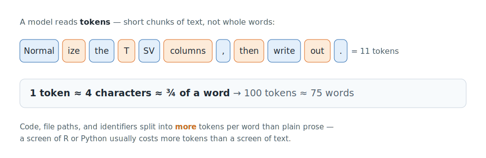{width="90%"}

::: notes
Tokens are the unit the model actually processes — roughly ¾ of a word. Two
practical takeaways for this audience: (1) documents are bigger than they look
— a 30-page PDF is tens of thousands of tokens; (2) pricing and limits are all
denominated in tokens, and generating output costs several times more than
reading input. That's the whole cost model in one sentence; skip the pricing
chart and move on.
:::

## The context window is a budget

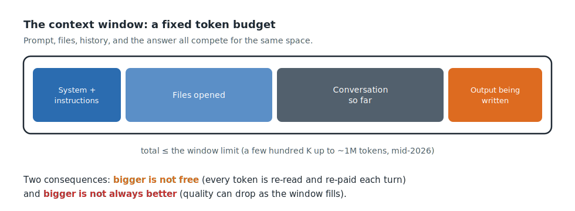{width="86%"}

::: notes
Everything competes for the same finite space: the instructions, the documents
it has opened, the running conversation, and the answer being written.
Two consequences drive every habit in Part 3: the whole window is re-read on
every turn (so bloat costs money and attention), and bigger is not free.
:::

## More context is not always better

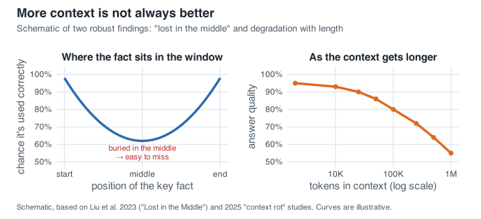{width="88%"}

::: {.small}
"Lost in the middle" [@doi:10.1162/tacl_a_00638]; degradation with input
length is reported across frontier models.
:::

::: notes
Two robust findings, in plain terms. "Lost in the middle": models attend best
to the start and end of the window and can miss material buried in the middle —
like a reviewer who reads the abstract and discussion carefully but skims page
14. "Context rot": answer quality can degrade as input grows long, sometimes
well below the advertised limit. A million-token window is not a promise of a
million tokens of attention. This is why the demo agent read papers one at a
time instead of swallowing the whole folder at once.
:::

# Part 3 — Working well with an agent {background-color="#222c38"}

## A notes file as memory

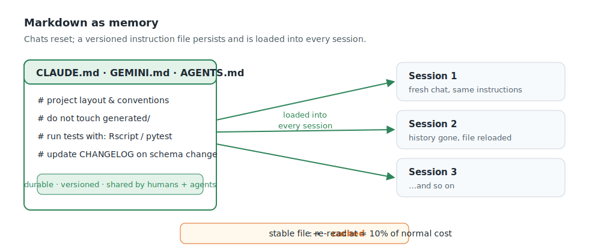{width="92%"}

::: notes
The single most useful habit, and it requires no programming: keep a plain-text
notes file in the project folder — background, goals, style preferences,
standing decisions — and the agent reads it at the start of every session.
Chats reset; the file persists. The filenames on the figure (CLAUDE.md,
AGENTS.md) are just conventions different tools read automatically; a plain
"project-notes.md" you point the agent at works everywhere. If you find
yourself typing the same instruction twice, it belongs in the file.
:::

## One task per conversation

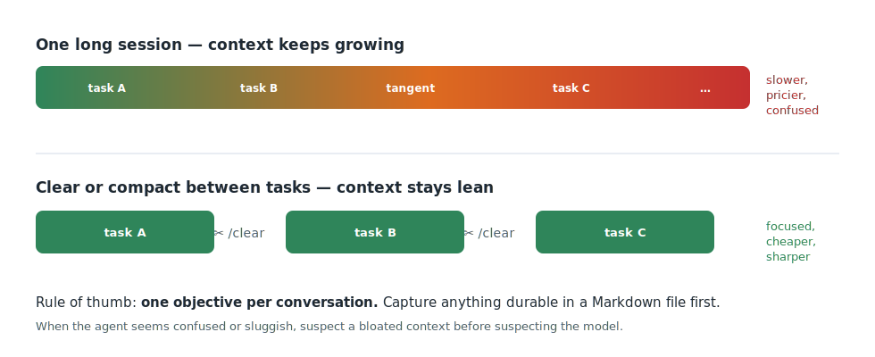{width="92%"}

::: notes
A long session accumulates stale documents, dead tangents, and old output — all
re-read every turn, all competing for attention (Part 2 made this concrete).
The fix is a rhythm: one objective per conversation; capture anything durable
in the notes file; start fresh for the next task. When the agent seems confused
or sluggish, suspect a bloated conversation before suspecting the tool.
:::

## Small playbooks beat one giant file

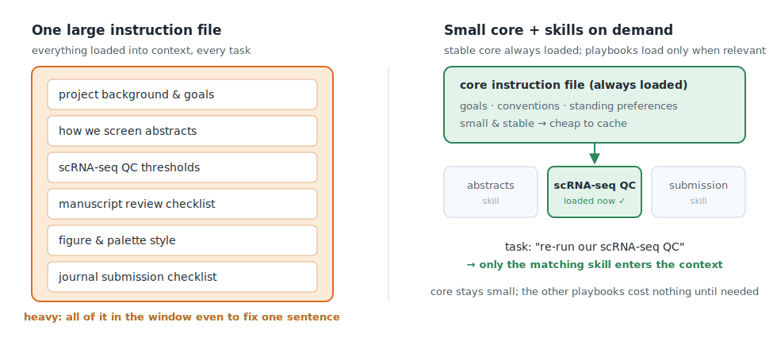{width="94%"}

::: notes
As the notes file grows, split it. Keep a small stable core (what the project
is, standing preferences) that loads every time, and move task-specific
procedures into separate documents the agent pulls in only when relevant: "how
we screen abstracts," "our figure style," "the journal's submission checklist."
Tools call these "skills"; the concept is just modular playbooks. Teams can
share them — that's how a lab encodes its habits once instead of per-person.
:::

## Privacy, PHI, and trust {background-color="#3a2430"}

- **Consumer chat accounts are not for PHI.** No patient data, no identifiable
  records — de-identify first, or don't paste it.
- **Institutional deployments differ** — a BAA-covered enterprise tool may be
  approved where a personal account is not. *Ask; don't assume.*
- Your **IRB, compliance office, and data-use agreements** outrank anything on
  these slides.
- And for everything the agent produces: **verify before it counts.**
  You sign the note.

::: notes
Non-optional slide for this audience; better to answer before they ask. Keep it
practical, not fearful: today's demo used open-access papers precisely because
that's the safe pattern — public or de-identified material flows freely, and
the sensitive-data question is an institutional one, not a slide-deck one.
The trust half is the attending framing again: hallucination is real, citations
must be spot-checked, and the professional signature never transfers.
:::

# Part 4 — How an agent reaches further {background-color="#222c38"}

## Four ways to extend one agent

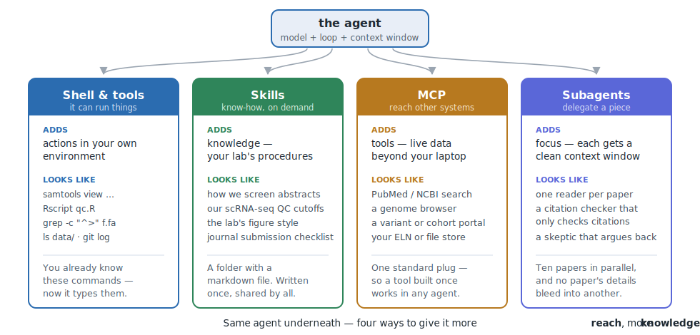{width="96%"}

::: notes
Orienting slide for the section — don't linger, the next four slides take these
one at a time. The framing that matters: it's the *same* agent underneath.
These are not four products; they are four ways to hand it more reach
(tools), more knowledge (skills), more connections (MCP), and more room to
think (subagents).

If you are running long, this slide alone covers the section. Show it, say the
one-liner for each column, and jump to "Where this is going."
:::

## Shell and tools: it can just run things

You already know this layer — it's your terminal.

- `samtools`, `bedtools`, `Rscript`, `grep`, `git`
- read a file, list a directory, fetch a URL

. . .

The novelty isn't the commands. It's that the agent **writes them, runs them,
reads the error, and tries again** — the loop you do by hand.

::: notes
This is the shortest slide in the section, deliberately: this audience already
lives here. The one point worth making is the feedback loop. When a tool
errors, the agent sees the stderr and adjusts — which is why "run the pipeline
and fix what breaks" is a reasonable instruction and "write me a pipeline"
in a chat window is not.

Honest caveat to say out loud: this is also the layer where an agent can do
real damage — `rm`, overwriting files, pushing to a shared branch. That is why
tools ask permission before running commands, and why you keep work in version
control. Do not turn approvals off on data you care about.
:::

## Skills: give it your lab's know-how

A **skill** is a folder with instructions — loaded only when relevant.

- "how we screen abstracts for this review"
- "our scRNA-seq QC thresholds, and why"
- "the figure conventions for our papers"

. . .

Written once. Shared by the whole lab. **Versioned like a protocol.**

. . .

People are already sharing these — genomics skill collections exist
today, and are young enough that yours could matter.

::: notes
Connect back to the notes-file slide in Part 3 — same idea, modular. The
framing that lands for scientists: a skill is a *protocol* for the agent. Your
lab already writes protocols so a new student does the thing the same way
twice; this is that, for a collaborator that happens to be software.

Verified as of July 2026, if asked for specifics (URLs are in the handout):
- the SKILL.md convention itself is public (github.com/anthropics/skills)
- GoekeLab/awesome-genomic-skills — a genomics lab's curated index of
  bioinformatics skill collections, which is the best single starting point
- google-deepmind/science-skills — genomics, structural biology, cheminformatics
- mims-harvard/ToolUniverse — Zitnik lab, wires up ~1,000 biomedical tools

Honest framing for the room: this ecosystem is real and growing fast, but it
is young — many overlapping 2026-vintage repos of uneven provenance, and some
adoption claims that are marketing rather than measurement. That is an
opportunity, not a warning: the conventions for how a lab packages its methods
knowledge are being set right now.
:::

## MCP: plug it into other systems

**Model Context Protocol** — one standard connector, so a tool built once
works in any agent.

- literature: **PubMed / NCBI Entrez**
- genomics resources and cohort portals
- your own institutional systems

. . .

The agent stops being limited to what's on your laptop.

::: notes
Keep the protocol talk light — the point is the *shape*: instead of every AI
product building its own PubMed integration, someone builds a PubMed MCP
server once and every agent can use it.

Verified as of July 2026, if asked (URLs in the handout):
- Anthropic ships a life-sciences connector set with PubMed, BioRender,
  Synapse, and 10x Genomics Cloud (github.com/anthropics/life-sciences)
- BioMCP (github.com/genomoncology/biomcp) is the broadest community one —
  a single server covering PubMed/PubTator, ClinVar, MyVariant, gnomAD, CIViC,
  OncoKB, cBioPortal, and ClinicalTrials.gov. That list should get this room's
  attention.
- there is a community registry (biocontext.ai/registry) for browsing more

I deliberately keep specific repo names off the slide — anything named here is
likely wrong within a year. Say instead: "look for a server for the resource
you care about; if none exists, that is a very tractable project for a
bioinformatics-capable lab, and the ecosystem is young enough to matter."

Caveat worth stating out loud: an MCP server is code you are trusting with
your session and your credentials. Prefer servers published by the
organization that owns the resource, or read the source.
:::

## Subagents: delegate with a clean desk

A **subagent** is a fresh agent with its own context window and a narrow job.

- one reader per paper — ten papers at once, no cross-contamination
- a **citation checker** whose only job is: *does this reference exist,
  and does it say what the sentence claims?*
- a skeptic asked to argue against your conclusion

. . .

Remember context rot? This is the structural fix: **many small windows
instead of one enormous one.**

::: notes
This lands best as the payoff of Part 2. A single agent reading forty papers
fills its window and starts losing the middle. Forty subagents, each reading
one paper into a clean window and returning a short structured answer, sidesteps
the problem — the coordinating agent only ever sees the summaries.

The citation checker is the example to dwell on for this audience, because
hallucinated or misattributed references are the failure mode they most fear
and most need to catch. A verification agent that never saw the draft being
defended is a genuinely better reviewer than the agent that wrote it.

This is also how the systems on the next slides work — Biomni and friends are
mostly orchestrations of specialized agents, not one giant prompt.
:::

# Where this is going {background-color="#222c38"}

## Agents built for biomedical research

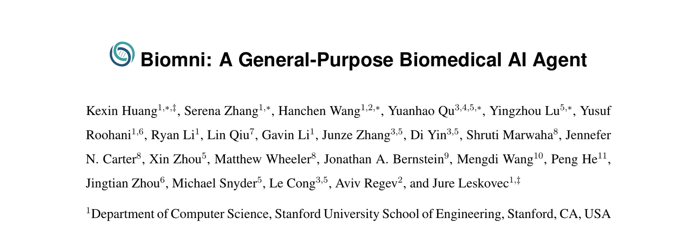{.paper-banner .nostretch width="88%"}

::: {.small}
Stanford · *Science* 2026 [@doi:10.1126/science.adz4351]
:::

- ~150 tools, ~60 databases, mined from the literature across 25 subdomains
- Given a goal, it **composes its own workflow** — gene prioritization,
  drug repurposing, rare-disease diagnosis

::: notes
This is the "how far does this go" slide. Everything earlier in the talk was
one agent doing one task you supervised. This is the same machinery pointed at
a whole study.

Be precise about status: the preprint is from 2025 and the peer-reviewed
version is in Science (2026). Show the preprint because it is open access —
which is itself a small lesson about what agents can and cannot fetch.

The skeptical note, and say it in the same breath: the benchmarks are the
authors' own. "Used by 10,000+ labs" is a usage number, not a validation
number. This is genuinely impressive engineering whose scientific validation
is still early.
:::

## Multi-agent systems that propose — and test

:::: {.columns}
::: {.column width="49%"}
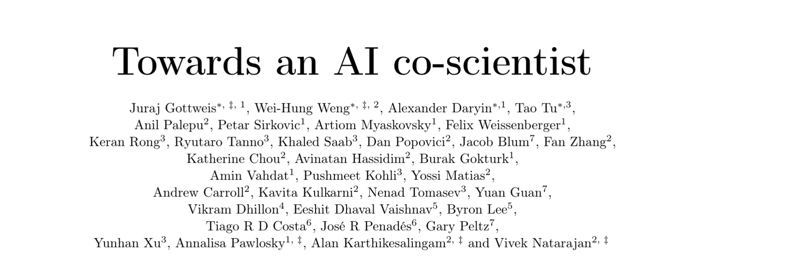{.paper-banner}

::: {.small}
Google · *Nature* 2026 [@doi:10.1038/s41586-026-10644-y]

Agents **debate and rank** hypotheses. It proposed KIRA6 for **AML** —
a compound no human had pointed it at — and it killed leukemia cells
in vitro at far lower doses than healthy cells.
:::
:::

::: {.column width="49%"}
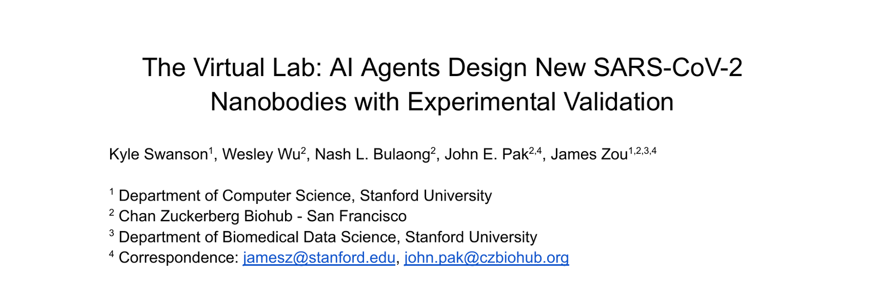{.paper-banner}

::: {.small}
Stanford + CZ Biohub · *Nature* 2025 [@doi:10.1038/s41586-025-09442-9]

An LLM "PI" runs meetings with LLM scientists; 92 nanobodies designed,
**two validated at the bench**.
:::
:::
::::

::: notes
Both of these are the subagent idea from two slides ago, taken to its
conclusion: not one agent, but a team of specialized ones that argue.

The honest reading of both, which this audience will respect you for saying:
- The validation experiments were run by the same groups that built the
  systems. That is not independent replication.
- In the Virtual Lab, a human still set the agenda and chose which designs to
  synthesize. Human-in-the-loop, not autonomous discovery.
- "Two of 92 worked" is a real result and also a reminder of the hit rate.

The point is not that these replace scientists. It is that hypothesis
generation and workflow composition are now things you can *delegate a draft
of* — and the reviewing is still yours.
:::

## Closer to home: agents in cancer research

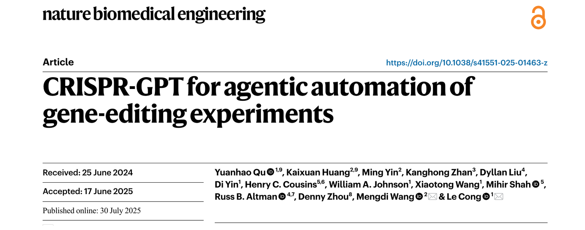{.paper-banner .nostretch width="80%"}

::: {.small}
Stanford/Princeton · *Nature Biomedical Engineering* 2025
[@doi:10.1038/s41551-025-01463-z] — plans and
executes gene-editing experiments end to end. **Wet-lab validated**: four
genes knocked out in a lung adenocarcinoma line, two activated in melanoma.
:::

::: notes
This is the slide for the molecular biologists. Everything else has been
documents and analysis; this one designed guides, drafted the protocol, and
the edits worked at the bench.

Note the dates on the banner — received June 2024, accepted June 2025. A
reminder that this field's peer-reviewed layer runs about a year behind the
preprints, which is why the earlier slides showed bioRxiv and arXiv.

Caveat: cancer cell lines here are the convenient validation system, not a
cancer-biology question. This is a gene-editing tool that happened to be
tested in cancer lines.
:::

## And the honest evaluation

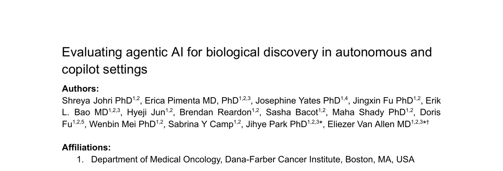{.paper-banner .nostretch width="86%"}

::: {.small}
Dana-Farber (Van Allen lab) · bioRxiv 2026 [@doi:10.64898/2026.06.04.729919]
— agents tested on single-cell multi-omics across **11 cancer types**.
:::

> Good at broad exploration. **Domain experts remained essential** for
> synthesis and methodological judgment.

::: notes
Deliberately the last paper, and the most important one for this room. It is
from a serious cancer-genomics group, it is on exactly their data type, and
its conclusion is measured rather than triumphant.

This is the slide that earns your credibility. A room of basic scientists has
been hearing AI hype for three years; showing them a careful evaluation that
says "useful for exploration, still needs you for synthesis" is both the honest
read and, conveniently, the thesis of this entire talk.

It is a preprint — say so.

If asked for more: there is a 2026 Cancer Cell paper from the same group on
retrieval-augmented precision-oncology recommendations, and a Frontiers in
Oncology review of LLMs and multi-agent systems across the precision-oncology
continuum. Both are in the handout.
:::

## What a good session looks like

- **One objective** per conversation; start fresh for the next
- Give it the **real documents**, not descriptions of them
- Keep durable facts in a **notes file** the agent always reads
- Keep task-specific procedures in **small playbooks**, loaded when needed
- **Verify the output** — spot-check citations, numbers, and extractions
- Nothing sensitive goes in without an **institutional green light**

::: notes
The synthesis slide — Parts 2 and 3 as one practical checklist. If they
remember one operational thing: "one task per conversation, durable facts in a
file, verify before it counts."
:::

## Try it this week

Start small and concrete — with material you already have:

- **A DOI list → a table**: your last review's references, five fields each,
  then spot-check two rows
- **Literature synthesis**: recent papers on your target or pathway → one page,
  cited, with disagreements flagged
- **Methods triage**: which of these 20 papers used 10x v3 vs. Smart-seq2,
  and at what depth?
- **Edit with pushback**: "tighten this Aims page and flag weak claims"
- **Draft from your outline**: turn notes into a deck or a first-draft section

::: {.footnote}
Today's `papers.csv` and prompts are in the handout repo — start from them.
:::

::: notes
All research-leaning, all PHI-free by construction, all in the handout with
copy-paste prompts. The advice that matters: pick material where you can judge
the output — your own field, your own documents — so verification is easy and
the failure modes are instructive rather than dangerous.
:::

## Free today — \$20 to keep going

- **Start free.** Every major tool has a free tier that covers today's examples.
- **Free tiers are demo-grade** — great for learning, but they hit a wall on
  sustained real work.
- One honest on-ramp: [**Claude Pro — \$20/mo**]{.amber} (\$17 annual),
  agent features included, cancel anytime.
- A *one-month rental* — cheaper than a textbook, and often **expensable**
  (PI, training-grant, or professional-development funds).
- A **fork, not a hurdle**: today needs nothing; *continuing* is worth \$20.

::: notes
Be honest and non-coercive. The equity risk is not the \$20 — it's the free
path quietly failing, so "optional" becomes "you had to pay to keep up." Scope
this week's experiments to fit a free tier; frame the subscription as "to keep
doing real work after this week." The recommendation was tested, not sponsored
— free tiers came up short on sustained document work. Full reasoning is in the
handout under "Paying for tools: an honest recommendation." Institutional
licenses may make this moot — worth asking before paying personally.
:::

## Takeaways

> AI agents are most useful when the work depends on
> **real documents, real folders, and real project context.**

- They **act** on your files — they don't just answer
- **Tokens and the context window** explain both cost and quality
- Keep context **lean**; keep durable knowledge in a **notes file**
- Treat the agent as a **trainee you supervise** — you sign the note
- Sensitive data needs an **institutional path**, not a personal account

::: notes
Land the plane on the one sentence. Everything else is detail in service of it.
:::

## Resources

**Handout** (this repo) — notes, prompts, today's `papers.csv`, and every
link below with full citations.

::::{.columns}
:::{.column width="50%"}
::: {.small}
**Papers shown**
Biomni · *Science* 2026
AI co-scientist · *Nature* 2026
The Virtual Lab · *Nature* 2025
CRISPR-GPT · *Nat Biomed Eng* 2025
Johri et al. · bioRxiv 2026
:::
:::
:::{.column width="50%"}
::: {.small}
**Tooling**
modelcontextprotocol.io
biocontext.ai/registry — biomedical MCP servers
BioMCP — PubMed, ClinVar, cBioPortal, OncoKB
awesome-genomic-skills — skills for genomics
:::
:::
::::

::: {.small}
And the document that actually governs what you may use: **your institution's
AI and data-governance policy.**
:::

::: notes
Leave this up for Q&A. Offer to share the repo — that is the real handout, and
it has working URLs for everything here, which a slide cannot.

Expect questions on: PHI specifics (route to compliance), hallucinated
citations (the verify habit), "which tool should I use" (concepts transfer;
handout has options), and "is my data training the model" (depends on account
type and institutional agreement — do not guess on stage, point to the policy).

Every link on this slide was verified the week of the talk. Re-verify before
you give it again — that is the whole point of the tools-change-fast lesson.
:::

::: {.footnote}
Token and context-window figures are mid-2026 and illustrative; exact numbers move fast.
:::

## References {.scrollable}

::: {.tiny}
::: {#refs}
:::
:::

::: notes
Auto-generated from the `@doi:` keys in this deck — quartobot resolves them
against Crossref at render, so the metadata is the publisher's, not mine.
Leave it up during Q&A alongside the resources slide, or skip past it; the
handout has the same list with links.
:::
